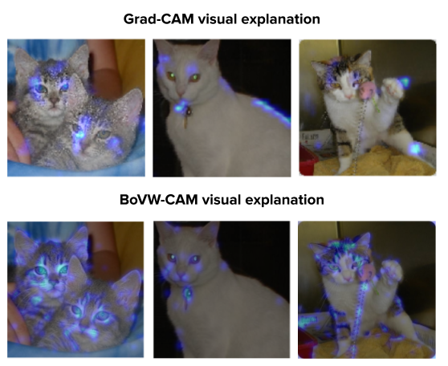

# BoVW-CAM: Visual Explanation from Bag of Visual Words



This repository contains the code and implementation for the paper titled "BoVW-CAM: Visual Explanation from Bag of Visual Words." The paper was presented at the 11th Brazilian Conference on Intelligent Systems (BRACIS 2022).

# Abstract

Classical computer vision solutions were used to extract image features designed by human experts for encoding visual scenes into vectors. Machine learning algorithms were then applied to model such vector space and assign labels to unseen vectors. Alternatively, such space could be composed of histograms generated using the Bag of Visual Words (BoVW) that compute the number of occurrences of clustered handcrafted features/descriptors in each image. Currently, Deep Learning methods automatically learn image features that maximize the accuracy of classification and object recognition. Still, Deep Learning fails in terms of interpretability. To tackle this issue, methods such as Grad-CAM allow the visualization of regions from input images that support the predictions generated by Convolutional Neural Networks (CNNs), i.e. visual explanations. However, there is a lack of similar visualization techniques for handcrafted features. This fact obscures the comparison between modern CNNs and classical methods for image classification. In this work, we present the BoVW-CAM that indicates the most important image regions for each prediction given by the BoVW technique. This way, we show a novel approach to compare the performance of learned and handcrafted features in the image domain.

# Install

```
pip install -r requirements.txt
```


# Demo

You can find an example of usage in the "demo.ipynb" notebook. The current example was performed on a toy dataset, but I intend to update it with a state-of-the-art dataset as soon as possible.

# Citation

If you find this work useful in your research, please consider citing:
```
@inproceedings{da2022bovw,
title={BoVW-CAM: Visual Explanation from Bag of Visual Words},
author={da Silva, Arnaldo Vitor Barros and Alves Pereira, Luis Filipe},
booktitle={Intelligent Systems: 11th Brazilian Conference, BRACIS 2022, Campinas, Brazil, November 28--December 1, 2022, Proceedings, Part II},
pages={45--55},
year={2022},
organization={Springer}
}
```